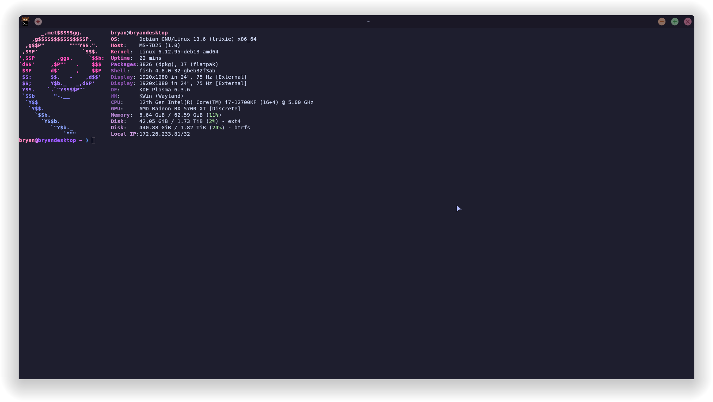

# My Dotfiles

Personal configuration files for my Linux setup.

## Setup

- **OS:** Debian Trixie
- **DE:** KDE Plasma 6 (Wayland)
- **Shell:** fish
- **Editor:** micro

## What's Here

- `fish/config.fish` - Custom prompt with pink/purple colors
- `fastfetch/config.jsonc` - Custom fastfetch output
- `.gitconfig` - Git config with GPG signing enabled
- `.gitignore` - Standard ignores

## Preview



## Installation

```fish
git clone https://github.com/TerminalTilt/dotfiles.git
cd dotfiles

# Copy fish config
cp fish/config.fish ~/.config/fish/config.fish

# Copy git config
cp .gitconfig ~/.gitconfig
```
## License
GPL v3
